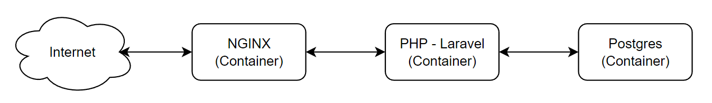

# Необходимый стек технологий: Ngnix, Docker/Docker Compose, Markdown, PHP - Laravel, Postgres

Описание и схема архитектуры сервиса


**Интернет**: Все начинается с запроса из Интернета. Это может быть запрос от пользователя или другого сервиса, который направлен на сервер, на котором работает бэкенд.

**NGINX (Docker Container)**: Первый контейнер представляет собой NGINX, который является веб-сервером и обратным прокси. Он обрабатывает входящие HTTP-запросы из Интернета, маршрутизирует их к соответствующему приложению и может выступать в роли балансировщика нагрузки.

**PHP - Laravel (Docker Container)**: Следующий контейнер запускает PHP-приложение с использованием фреймворка Laravel. NGINX перенаправляет запросы к этому контейнеру, где они обрабатываются приложением Laravel. Это ядро бэкенд-системы, которое выполняет бизнес-логику, обрабатывает данные и генерирует ответы.

**Postgres (Docker Container)**: Последний контейнер содержит базу данных Postgres. Приложение Laravel взаимодействует с этой базой данных для сохранения и извлечения данных. Это могут быть любые операции с данными, например, запросы, вставки, обновления и удаления записей.

\
Для запуска такого многоконтейнерного сервиса, необходимо использовать **Docker Compose**. \
**Docker Compose** позволяет определить и запустить множество контейнеров Docker с помощью одного файла конфигурации, называемого `docker-compose.yml`

---
# Задание - создать RESTful API сервис
- Создать конфигурационный файл `docker-compose.yml` для запуска данного сервиса.
- Создать документацию в формате **Markdown** в файле `README.md`, которая описывает процесс настройки и запуска данного сервиса, а также описание и примеры работы API.
- Создать RESTful API для одной сущности - **Пост**, который обладает следующими атрибутами: ID, Заголовок, Дата публикации, Текст.

Пример структуры поста в формате JSON
```
{
  "id": 1,
  "title": "Hello World",
  "updated_at": "2020-10-15T07:20:42.000000Z",
  "content": "Lorem ipsum dolor sit amet, consectetur adipiscing elit, sed do eiusmod tempor incididunt ut labore et dolore magna aliqua. Ut enim ad minim veniam, quis nostrud exercitation ullamco laboris nisi ut aliquip ex ea commodo consequat. Duis aute irure dolor in reprehenderit in voluptate velit esse cillum dolore eu fugiat nulla pariatur. Excepteur sint occaecat cupidatat non proident, sunt in culpa qui officia deserunt mollit anim id est laborum."
}
```
Реализовать следующие RESTful API операции для поста:
|  Название                    |HTTP Метод|  Маршрут (URL)      | 
|------------------------------|----------|---------------------|
| Получение списка постов      | `GET`    | `/api/posts`        |
| Получение конкретного поста  | `GET`    | `/api/posts/{post}` |
| Создание поста               | `POST`   | `/api/posts`        |
| Изменение поста              | `PUT`    | `/api/posts/{post}` |
| Удаление поста               | `DELETE` | `/api/posts/{post}` |

Готовое задание разместить публичным репозиторием на Github и прислать ссылку на этот репозиторий (очень просим проверить доступность и корректность ссылки на репозиторий)

При выполнении данного задания будет большим плюсом, если вы примените лучшие практики, чтобы выполненнное задание было не только рабочим, но и качественным. Проявите профессионализм, чтобы показать уровень вашей компетенции. 
